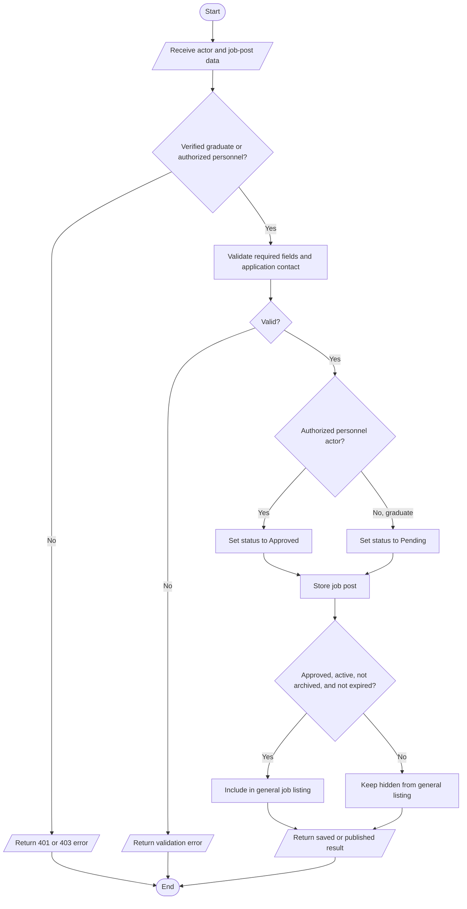
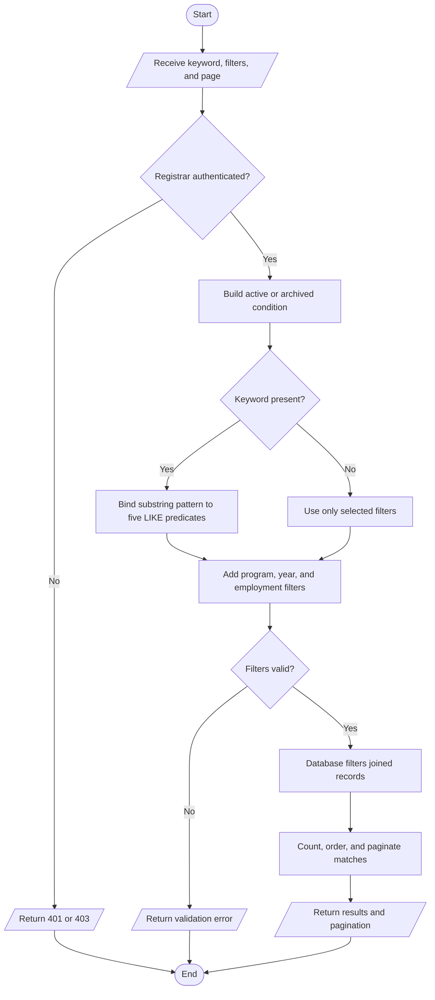
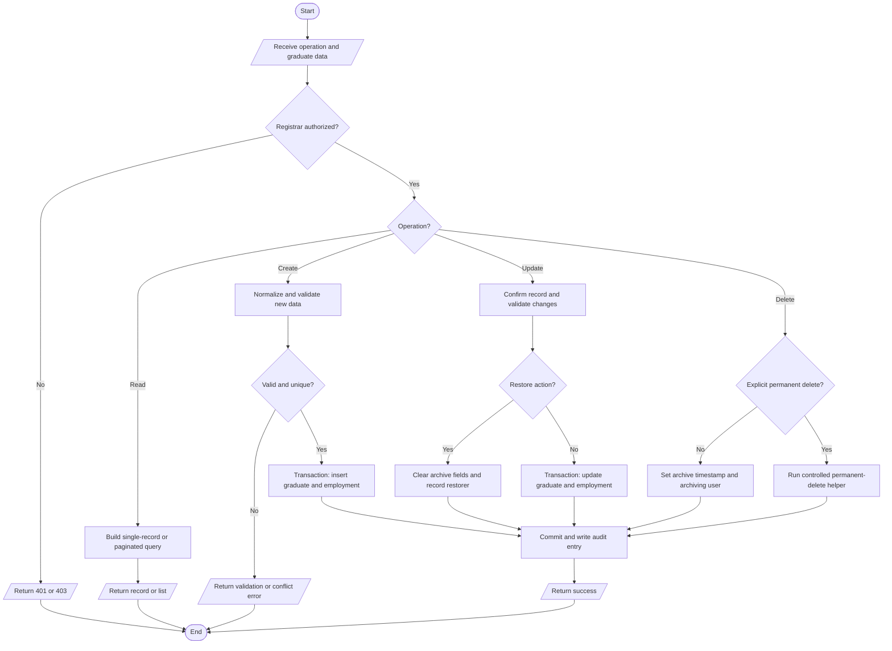
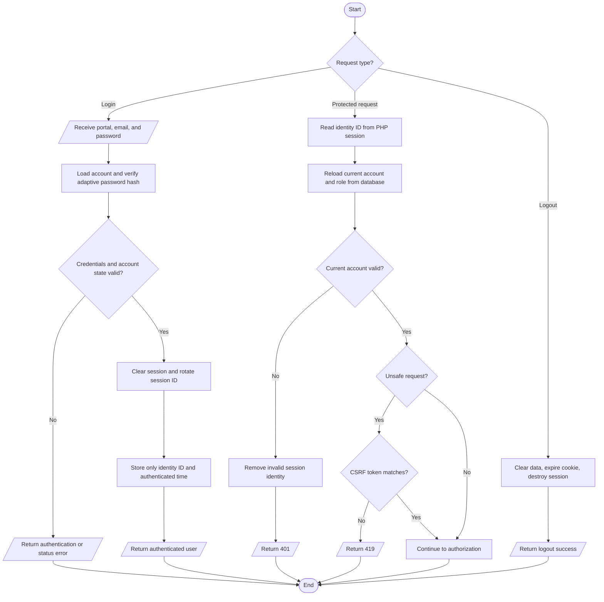
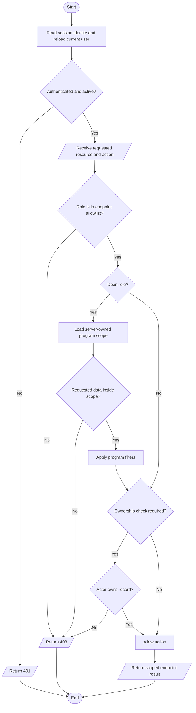
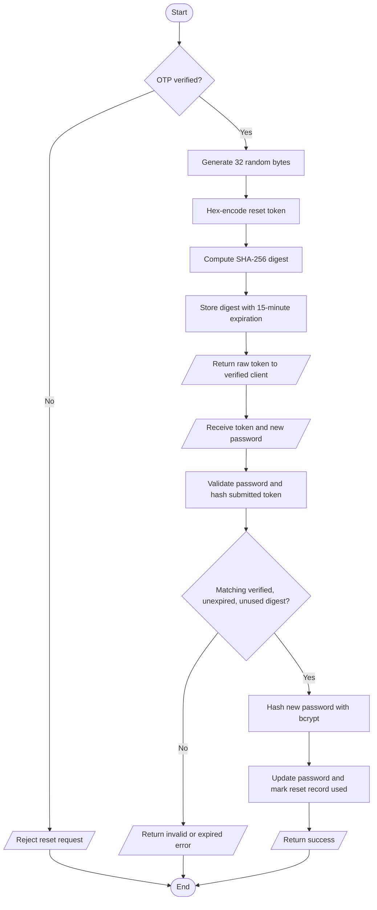
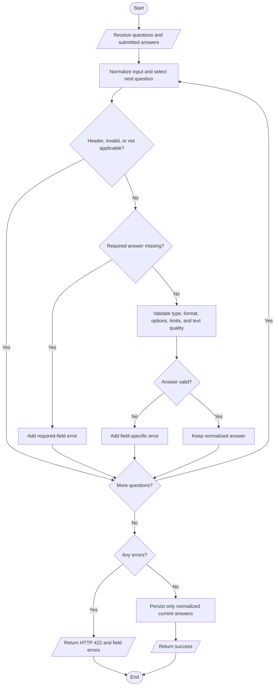
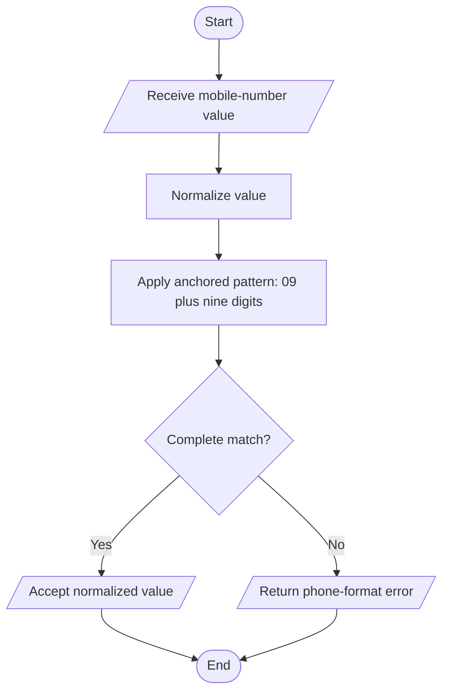
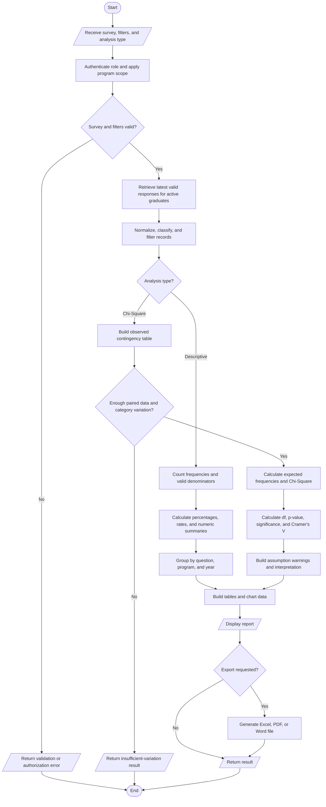

# GradTrack System Algorithms

**System:** GradTrack: A Web-Based Graduate Tracer System with Alumni Job Support System for Norzagaray College  
**Documentation basis:** Current repository implementation audited on October 5, 2026  
**Scope:** First-party frontend, backend APIs, shared security helpers, survey processing, graduate records, job posting and moderation, analytics, reports, exports, and relevant tests  
**Change scope:** Documentation only; no application logic, database schema, API contract, authentication flow, analytics formula, report, or user-interface behavior was changed.

## Introduction

GradTrack uses several algorithms and rule-driven processes to authenticate users, manage records, enforce permissions, validate data, search stored records, moderate job posts, process tracer survey responses, and produce statistical reports. This document describes those processes from the current source code rather than from a proposed design.

The audit used repository-wide searches across the first-party PHP, TypeScript, TSX, JavaScript, and SQL files, followed by direct inspection of the execution paths relevant to the nine requested algorithms. Existing algorithm documents were treated as secondary material only; the implementation files listed in this document are the source of truth.

### Important implementation corrections

1. GradTrack does not implement an application-level linear-search loop for graduate records. The frontend sends a keyword to the backend, and MySQL performs a parameterized `LIKE '%keyword%'` search. The thesis-friendly name should therefore be **Database-Delegated Record Search and Filtering Algorithm**.
2. SHA-256 is not used to store or verify passwords. Passwords use PHP's adaptive `password_hash` and `password_verify` functions. SHA-256 is used for high-entropy password-reset tokens, file checksums, request signatures through HMAC-SHA-256, cache keys, and data fingerprints. The representative process below is therefore named **SHA-256 Password-Reset Token Hashing Algorithm**.
3. Graduate deletion normally means archiving through an `archived_at` timestamp. An explicit permanent-delete path also exists for already archived graduate records. The more accurate name is **CRUD with Archive, Restore, and Controlled Permanent Deletion Algorithm**.
4. The access model is RBAC plus data scoping and ownership checks. Dean roles are restricted to assigned program codes, while job-post updates and deletes also check record ownership. The more accurate name is **Role- and Scope-Based Access Control Algorithm**.
5. Statistical processing includes frequencies, percentages, arithmetic mean, median, minimum, maximum, employment and alignment rates, a Chi-Square Test of Independence, p-value calculation, and Cramer's V. Weighted mean and survey-response standard deviation are not implemented in the active survey analytics flow.
6. The current personnel role list also includes `mis_staff`, although it was not included in the original list supplied for this revision. Graduate users are authenticated through a separate graduate-account flow rather than through the personnel `admin_users` role column.

### Audit findings overview

| Requested algorithm | Audit result | Representative implementation | Required correction or limitation |
|---|---|---|---|
| Rule-Based Decision Algorithm | Implemented | Job-post approval and publication rules | Use a specific rule name; unrelated rules should not be merged into one diagram. |
| Linear Search Algorithm | Not implemented as an application-level linear loop | Graduate search through parameterized SQL `LIKE` predicates | Rename to database-delegated record search and filtering. |
| CRUD Operation Algorithm | Implemented | Registrar-managed Graduate Records API | Default delete is archive; permanent deletion is a separate controlled action. |
| Session Management Algorithm | Implemented | Server-side PHP cookie sessions for personnel and graduates | No JWT is used, and no custom idle-session expiration check is implemented. |
| RBAC Algorithm | Implemented | Server-side role allowlists, frontend route guards, Dean program scope, and ownership checks | Describe it as role- and scope-based access control. |
| Secure Hash Algorithm (SHA-256) | Implemented, but not for passwords | Password-reset token hashing | Password hashing must be documented separately as adaptive hashing. |
| Input Validation Algorithm | Implemented | Mirrored frontend/backend tracer-survey validation | The backend validation is authoritative. |
| Pattern Matching Algorithm | Implemented | Philippine mobile-number regular expression | Regex is also used for email, phone, numeric, field classification, and readable-text checks. |
| Statistical Calculation Algorithm | Implemented | Descriptive analytics and Chi-Square inferential analysis | No weighted mean or survey-response standard deviation is present. |

### Complexity notation

- `N` = number of candidate database records.
- `M` = number of records matching a filter.
- `K` = length of a search keyword or text value.
- `Q` = number of survey questions.
- `R` = number of survey responses.
- `A` = total number of submitted answer values, including checkbox selections.
- `P` = number of programs or grouped dimensions.
- `Y` = number of graduation-year groups.
- `r` and `c` = numbers of row and column categories in a contingency table.
- Database costs depend on schema indexes, query plans, joins, storage, and server conditions. Application-level and database-dependent costs are therefore distinguished below.

## 1. Rule-Based Decision Algorithm

### Purpose

To determine whether a newly submitted job post is published immediately or placed in the Alumni President's approval queue, and whether the post is visible to general job browsers.

### Actual GradTrack Implementation

The representative rule is implemented in the job-posting module:

- A verified graduate or an authorized personnel user may submit a job post.
- Personnel roles allowed to create job posts are Research Coordinator, Alumni President, and the three Dean roles.
- Posts created by those personnel roles are automatically assigned `approved` status.
- Posts created by graduates are assigned `pending` status.
- The Alumni President is the only personnel role allowed by the moderation endpoint to approve or decline graduate-owned posts.
- A general job listing includes only posts that are approved, active, not archived, and not past their application deadline.
- Owners can still retrieve their own pending, inactive, or expired posts through the owner-specific flow. Archived posts are retained for administrative history.

This is a rule-based state decision, not machine learning or probabilistic classification.

Other rule-based paths were verified but are intentionally not merged into the representative flowchart:

- Survey submission requires an active, non-archived survey, configured graduation-year coverage, an eligible graduate year, and a valid unexpired token (`backend/api/surveys/responses.php`).
- Graduate portal access requires both account status `active` and alumni verification status `approved`; pending, rejected, inactive, and disabled states return different access results (`backend/api/config/graduate_auth.php`).
- Active graduate accounts whose last login/reactivation is at least 365 days old are changed to `disabled` (`backend/api/config/graduate_account_status.php`).
- Dean report and dashboard queries are restricted to the program codes mapped from the authenticated Dean role (`backend/api/config/dean_program_scope.php`).

### Input

- Authenticated actor type: graduate or personnel.
- Personnel role when the actor is a personnel user.
- Job fields, including title, company, description, application contact, active flag, and optional deadline.
- Existing approval, active, archive, and deadline state for later retrieval or moderation.

### Process

1. Resolve the current actor from the graduate or personnel session.
2. Confirm that the actor is a verified graduate or a personnel role authorized for job posting.
3. Validate required job fields and application contact information.
4. If the actor is authorized personnel, set approval status to `approved`; otherwise, set a graduate submission to `pending`.
5. Store the job post and any valid requirements-file metadata in a transaction.
6. For general visibility, require `approved`, active, not archived, and not expired.
7. Allow the Alumni President to change a graduate-owned pending post to `approved` or `declined`.
8. Publish a realtime event and write an audit-trail record after a successful action.

### Output

- Published job post for an authorized personnel submission.
- Pending job post for a graduate submission.
- Approved or declined status after Alumni President review.
- Public/graduate listing that excludes unapproved, inactive, archived, or expired posts.

### Error or Invalid Cases

- Unauthenticated actor: HTTP 401.
- Authenticated but unauthorized personnel role: HTTP 403.
- Missing title, company, or description: HTTP 400.
- Missing all application-contact methods: HTTP 400.
- Invalid contact email or uploaded requirements file: validation error.
- Non-owner update/delete attempt: HTTP 403.
- Invalid moderation status or archive/restore state: HTTP 400 or 409.

### Pseudocode

**Algorithm Name: Rule-Based Job Publication and Moderation Decision Algorithm**

**Purpose:** Decide the approval state and visibility of a submitted job post.

**Input:** Authenticated actor, actor role, job-post data, current post state.

**Output:** Approved, pending, declined, hidden, archived, or visible job-post result.

```text
BEGIN
    RECEIVE authenticated actor and job-post data

    IF actor is not a verified graduate AND actor is not authorized personnel THEN
        RETURN authentication or permission error
    END IF

    VALIDATE required job fields and application contact
    IF validation fails THEN
        RETURN validation error
    END IF

    IF actor is authorized job-posting personnel THEN
        SET approval status to APPROVED
        SET reviewer information to the personnel actor
    ELSE
        SET approval status to PENDING
    END IF

    STORE the job post in the database

    IF approval status is APPROVED
       AND post is ACTIVE
       AND post is NOT ARCHIVED
       AND deadline is not expired THEN
        MAKE post visible in the general job listing
    ELSE
        KEEP post outside the general job listing
    END IF

    IF a pending graduate post is reviewed by the Alumni President THEN
        IF review decision is APPROVE THEN
            SET approval status to APPROVED
        ELSE IF review decision is DECLINE THEN
            SET approval status to DECLINED
        ELSE
            RETURN invalid review decision
        END IF
    END IF

    RECORD audit information and publish the appropriate realtime event
    RETURN job-post status and result message
END
```

### Flowchart



### Time Complexity

**Best Case:** `O(1)` application decision work when a request fails an early fixed validation or authorization rule.  
**Average Case:** `O(J + D)` where `J` is the fixed number of validated job fields and `D` is the database insert/update cost. The role list is scanned with `in_array`, but it is a small fixed list.  
**Worst Case:** The decision logic remains `O(J)`. General job listing can require `O(N)` filtering and up to `O(M log M)` ordering when the database cannot satisfy filtering and ordering from indexes.  
**Explanation:** The approval decision itself evaluates a fixed set of conditions. Record storage, file handling, listing, and sorting are separate database/storage costs.

### Relevant Source Files

- `backend/api/config/admin_roles.php`, functions `gradtrack_job_posting_admin_roles` and `gradtrack_job_posting_auto_approval_roles` (lines 56-70).
- `backend/api/jobs/posts.php`, functions `gradtrack_jobs_current_actor`, `gradtrack_jobs_require_actor`, and `gradtrack_jobs_actor_can_auto_approve` (lines 29-66); visibility rules (lines 457-517); create flow (lines 589-735).
- `backend/api/config/engagement_approval.php`, function `gradtrack_engagement_admin_roles` (lines 14-18).
- `backend/api/moderation/approvals.php`, reviewer authorization (lines 142-159) and approval/archive decisions (lines 358-480).
- `frontend/src/pages/GraduatePortal.tsx`, graduate job-post creation and status presentation.
- `frontend/src/pages/admin/JobPostings.tsx`, personnel job-post management.
- `frontend/src/pages/admin/EngagementApprovals.tsx`, Alumni President review interface.

## 2. Linear Search Algorithm

### Purpose

To find graduate records whose first name, middle name, last name, student number, or email contains a supplied keyword, while also supporting program, graduation-year, employment-status, archive, and pagination filters.

### Actual GradTrack Implementation

The requested name is technically inaccurate. The React page does not download every graduate and sequentially compare each one. It sends the keyword and filters to `backend/api/graduates/index.php`. The backend builds parameterized SQL predicates using `LIKE '%keyword%'`, executes a count query, then executes a joined, ordered, paginated query.

The database engine may use a table/index scan internally. Because every search pattern begins with `%`, an ordinary B-tree index generally cannot perform a prefix lookup for the keyword. This makes a scan-like database execution likely, but it is still not an application-level linear-search implementation.

### Input

- Search keyword.
- Optional program ID, graduation year, employment status, and archive view.
- Page number and page-size limit.
- Authenticated Registrar session.

### Process

1. Require the Registrar role.
2. Read and validate the optional filters.
3. Wrap the search keyword with `%` for substring matching.
4. Build parameterized `LIKE` conditions for five graduate fields.
5. Add exact program, year, employment, and archive conditions when present.
6. Execute a `COUNT(DISTINCT g.id)` query for pagination.
7. Execute the joined `SELECT`, ordered by graduation year and graduate name.
8. Limit the result to the requested page.
9. Return the records, filter options, archive counts, and pagination metadata.

### Output

- Matching graduate records for the requested page.
- Total record count and number of pages.
- Current filter options and active/archive counts.

### Error or Invalid Cases

- Non-Registrar or unauthenticated request: HTTP 401 or 403.
- Invalid graduation year: HTTP 400.
- Database failure: safe HTTP 500 response without raw database details.
- No matches: successful response with an empty data array.

### Pseudocode

**Algorithm Name: Database-Delegated Record Search and Filtering Algorithm**

**Purpose:** Search graduate records through parameterized database predicates.

**Input:** Keyword, filters, archive scope, page, limit.

**Output:** Matching page of graduate records and pagination metadata.

```text
BEGIN
    REQUIRE authenticated Registrar
    RECEIVE keyword, filters, archive view, page, and limit

    SET archive condition to active or archived records

    IF keyword is not empty THEN
        SET search pattern to PERCENT + keyword + PERCENT
        ADD parameterized LIKE conditions for:
            first name
            middle name
            last name
            student number
            email
    END IF

    IF a program filter is supplied THEN
        ADD exact program condition
    END IF

    IF a graduation year is supplied THEN
        VALIDATE the four-digit year
        IF invalid THEN
            RETURN validation error
        END IF
        ADD exact graduation-year condition
    END IF

    IF an employment-status filter is supplied THEN
        ADD exact employment-status condition
    END IF

    EXECUTE parameterized count query
    EXECUTE parameterized joined and ordered query with LIMIT and OFFSET
    RETURN matching records, total count, page count, and filter options
END
```

### Flowchart



### Time Complexity

**Best Case:** Database-dependent. With an empty dataset, rejection before execution, or a selectively indexed exact filter, the work can be near `O(1)` to `O(log N)` plus result construction.  
**Average Case:** Common substring searches are approximately `O(N × K)` character-comparison work in the database, plus ordering of matches when an index cannot supply the requested order.  
**Worst Case:** `O(N × K + M log M)` for scanning candidate text values and sorting matching rows, plus `O(N)` for the separate count query.  
**Explanation:** The backend itself builds a constant number of SQL predicates; MySQL performs the record traversal. The leading `%` in each search pattern makes normal prefix-index lookup unsuitable for the substring portion, so calling this a database scan/filter is more accurate than claiming an application-level linear search.

### Relevant Source Files

- `frontend/src/pages/admin/Graduates.tsx`, search state and query construction (around lines 408-520 and 1161-1177).
- `backend/api/graduates/index.php`, Registrar authorization (lines 113-118), search predicates (lines 154-188), count and paginated query (lines 190-279).
- `backend/api/forum/conversation-info.php`, another database-delegated `LIKE` search for people and program information (lines 179-182).
- `backend/api/jobs/posts.php`, database-delegated job search across job, poster, and program fields (lines 529-557).

## 3. CRUD Operation Algorithm

### Purpose

To create, read, update, archive, restore, and—only through an explicit controlled action—permanently delete graduate records and their related employment data.

### Actual GradTrack Implementation

The representative entity is the Registrar-managed Graduate Record. The endpoint dispatches by HTTP method after requiring the Registrar role:

- `POST` creates a graduate and a related employment row in one transaction.
- `GET` reads one graduate or returns a filtered, sorted, paginated list.
- `PUT` updates a graduate and related employment row, or restores an archived record.
- `DELETE` normally performs a soft delete by setting `archived_at` and `archived_by`.
- `DELETE` with the explicit `permanent_delete` action invokes dedicated helpers for already archived records. This is not the normal delete behavior.

Successful create, update, archive, restore, import, and permanent-delete actions are written to the audit trail.

### Input

- HTTP operation and optional action.
- Graduate ID or IDs.
- Graduate identity, contact, program, year, address, and employment fields.
- Authenticated Registrar identity.

### Process

1. Enforce session authentication, Registrar authorization, origin rules, request-size rules, and CSRF protection for authenticated unsafe requests.
2. Select the CRUD branch from the HTTP method and optional action.
3. Normalize names and nullable text.
4. Validate year, optional email, optional Philippine mobile number, and duplicate student number/email conditions.
5. Use prepared statements for all supplied values.
6. Use a database transaction when graduate and employment rows must change together.
7. For normal deletion, set archive metadata instead of removing the row.
8. Restore only a currently archived record.
9. Permit permanent deletion only through the explicit permanent-delete helper and archive-oriented workflow.
10. Commit and return success, or roll back and return a safe error.

### Output

- Created record ID.
- Single or paginated graduate data.
- Updated, archived, restored, or permanently deleted status.
- Audit-trail entry for successful state changes.

### Error or Invalid Cases

- Missing or invalid ID/year.
- Invalid email or mobile number.
- Duplicate student number or email.
- Missing graduate record.
- Attempt to edit an archived record before restoration.
- Attempt to restore an already active record or archive an already archived record.
- Database exception, with rollback when a transaction is active.

### Pseudocode

**Algorithm Name: CRUD with Archive, Restore, and Controlled Permanent Deletion Algorithm**

**Purpose:** Manage the complete lifecycle of a graduate record.

**Input:** Operation, graduate data, record identifiers, authenticated Registrar.

**Output:** Requested data or a success/error response.

```text
BEGIN
    REQUIRE authenticated Registrar
    RECEIVE HTTP operation, optional action, and request data

    IF operation is READ THEN
        IF a graduate ID is supplied THEN
            RETRIEVE the matching active or archived graduate
            RETURN record or not-found error
        ELSE
            APPLY search, filter, archive, order, and pagination conditions
            RETURN record list and pagination details
        END IF

    ELSE IF operation is CREATE THEN
        NORMALIZE graduate and employment fields
        VALIDATE year, optional email, optional mobile number, and uniqueness
        IF invalid THEN RETURN validation or conflict error

        BEGIN DATABASE TRANSACTION
        INSERT graduate record
        INSERT related employment record
        COMMIT TRANSACTION
        WRITE audit entry
        RETURN new record ID

    ELSE IF operation is UPDATE THEN
        VALIDATE ID and confirm the record exists

        IF action is RESTORE THEN
            CLEAR archive fields and set restore fields
            IF record was not archived THEN RETURN conflict error
            WRITE audit entry
            RETURN success
        END IF

        IF record is archived THEN
            RETURN error requiring restoration first
        END IF

        NORMALIZE and VALIDATE updated fields and uniqueness
        BEGIN DATABASE TRANSACTION
        UPDATE graduate record
        UPDATE related employment record
        COMMIT TRANSACTION
        WRITE audit entry
        RETURN success

    ELSE IF operation is DELETE THEN
        IF action is PERMANENT_DELETE THEN
            REQUIRE valid archived target or archive group
            EXECUTE controlled permanent-delete helper
            WRITE audit entry
            RETURN deleted count
        ELSE
            SET archived timestamp and archiving user
            IF record is already archived or missing THEN RETURN error
            WRITE audit entry
            RETURN archive success
        END IF

    ELSE
        RETURN method-not-allowed error
    END IF

    IF a database error occurs during a transaction THEN
        ROLL BACK TRANSACTION
        RETURN safe error response
    END IF
END
```

### Flowchart



### Time Complexity

**Best Case:** `O(1)` application work for an early invalid request; an indexed single-record lookup or write is commonly `O(log N)` at the database level.  
**Average Case:** Indexed single-record create/read/update/archive operations are database-dependent but commonly near `O(log N)`. Listing is at least `O(M)` to materialize returned records.  
**Worst Case:** A filtered and ordered list can reach `O(N + M log M)`. A batch archive or permanent delete of `B` records is at least `O(B)` plus referential cleanup and storage operations.  
**Explanation:** “CRUD” is a family of operations, so one complexity value would be misleading. Transactions do not change asymptotic complexity but add correctness and database I/O overhead.

### Relevant Source Files

- `backend/api/graduates/index.php`, method dispatch and read flow (lines 113-281), create flow (lines 283-456), update/restore flow (lines 458-644), archive/permanent-delete flow (lines 646-897).
- `backend/api/config/graduate_record_validation.php`, optional email and mobile validation.
- `backend/api/config/permanent_delete.php`, controlled permanent-delete helpers and preservation/cleanup logic.
- `backend/api/config/archive.php`, shared archive schema helpers.
- `frontend/src/pages/admin/Graduates.tsx`, Registrar record-management interface.
- `backend/tests/graduation_archive_http_integration.php` and `backend/tests/graduation_year_permanent_delete_integration.php`, archive and permanent-delete behavior tests.

## 4. Session Management Algorithm

### Purpose

To create, validate, use, and destroy authenticated server-side sessions for personnel and graduate users.

### Actual GradTrack Implementation

GradTrack uses native PHP server-side sessions with a cookie named from configuration, defaulting to `GRADTRACKSESSID`. It does not use JWT authentication.

The session configuration enables cookie-only sessions, strict mode, disabled URL session IDs, HTTP-only cookies, SameSite protection, and Secure cookies in production. On successful login, the system clears the session, rotates the session identifier, and stores only one identity key—`admin_user_id` or `graduate_account_id`—plus `authenticated_at`.

For every protected request, the identity is read from the session and the current user, role, active state, verification state, and scoped data are reloaded from the database. Authenticated unsafe requests also require a CSRF synchronizer token. Logout clears the session array, expires the session cookie, and destroys the server session.

There is no implemented application-level idle or absolute session-expiration comparison. The cookie lifetime is `0`, meaning it is a browser-session cookie, and server cleanup relies on PHP session handling. The stored `authenticated_at` value and the legacy `session_timeout_minutes` setting are not used to expire a session.

Graduate account disabling after 365 days of account inactivity is implemented, but that is an account-status rule, not a login-session timeout.

### Input

- Portal type: personnel or graduate.
- Email and password for login.
- Session cookie on later requests.
- CSRF token for authenticated POST, PUT, PATCH, or DELETE requests.
- Logout request.

### Process

1. Validate request method and required credentials.
2. Apply login throttling.
3. Query the appropriate account by normalized email.
4. Verify the password with `password_verify` or the controlled non-production legacy path for personnel accounts.
5. Confirm active/verified account state and maintenance-mode access.
6. Clear the existing session and regenerate its identifier.
7. Store only the applicable user ID and authentication timestamp.
8. On a protected request, read the ID, release the session lock, and reload the account from the database.
9. Reject and remove invalid/deactivated identities.
10. For unsafe authenticated requests, compare the CSRF header with the session token.
11. On logout, record the audit event, clear state, expire the cookie, and destroy the session.

### Output

- Authenticated user object after successful login or session check.
- HTTP 401/403/419 errors for missing authentication, forbidden account state, or invalid CSRF token.
- Destroyed session and success response after logout.

### Error or Invalid Cases

- Missing credentials or wrong HTTP method.
- Invalid email/password or throttled attempts.
- Deactivated personnel account.
- Pending, rejected, inactive, disabled, or unverified graduate account.
- Invalid session ID, missing account, or archived graduate.
- Missing/mismatched CSRF token on an authenticated unsafe request.
- Session start or regeneration failure.

### Pseudocode

**Algorithm Name: Server-Side Cookie Session Management Algorithm**

**Purpose:** Maintain authenticated personnel and graduate sessions without JWTs.

**Input:** Login credentials, session cookie, protected request, or logout request.

**Output:** Authenticated session, validated user, rejection, or destroyed session.

```text
BEGIN
    CONFIGURE cookie-only PHP sessions with strict, HTTP-only, SameSite settings
    ENABLE Secure cookie in production

    IF request is LOGIN THEN
        RECEIVE portal type, email, and password
        VALIDATE required credentials and login-throttle state
        LOAD the matching personnel or graduate account
        VERIFY password using adaptive password verification

        IF credentials are invalid THEN
            RECORD failed attempt
            RETURN authentication error
        END IF

        IF account or system status forbids access THEN
            RETURN forbidden response
        END IF

        CLEAR previous session values
        REGENERATE session identifier
        STORE only personnel ID or graduate-account ID
        STORE authentication timestamp
        RETURN authenticated user

    ELSE IF request is PROTECTED REQUEST THEN
        READ identity ID from server-side session
        IF no identity exists THEN
            RETURN authentication-required response
        END IF

        RELOAD the current account and role from the database
        IF account is missing, inactive, unverified, disabled, or archived THEN
            REMOVE or destroy invalid session identity
            RETURN authentication-required response
        END IF

        IF request changes data THEN
            COMPARE submitted CSRF token with session CSRF token
            IF tokens do not match THEN
                RETURN CSRF error
            END IF
        END IF

        CONTINUE to authorization and endpoint processing

    ELSE IF request is LOGOUT THEN
        WRITE logout audit entry when identity is available
        CLEAR session data
        EXPIRE session cookie
        DESTROY server-side session
        RETURN logout success
    END IF
END
```

### Flowchart



### Time Complexity

**Best Case:** `O(1)` for detecting a missing session identity or clearing a session, excluding filesystem/session-store I/O.  
**Average Case:** `O(H + log U)` for login or validation when the account email/ID is indexed; `H` represents the deliberately expensive adaptive password-verification cost.  
**Worst Case:** `O(H + U)` if an account lookup cannot use an index, plus external session-store or database latency.  
**Explanation:** Cookie and session-field operations are constant in size. Account lookup and password verification dominate login; protected requests perform a database reload so a changed role or deactivated account takes effect immediately.

### Relevant Source Files

- `backend/api/config/session.php`, cookie settings, session start, identity establishment, rotation, and destruction (lines 6-151).
- `backend/api/auth/login.php`, personnel login and session establishment (lines 11-114).
- `backend/api/auth/check.php` and `backend/api/auth/logout.php`, personnel validation and logout.
- `backend/api/graduate-auth/login.php`, graduate password/status checks and session establishment (lines 9-91).
- `backend/api/config/graduate_auth.php`, current graduate reload and invalid-session cleanup (lines 223-340).
- `backend/api/graduate-auth/check.php` and `backend/api/graduate-auth/logout.php`, graduate validation and logout.
- `backend/api/config/csrf.php`, authenticated unsafe-request CSRF enforcement (lines 18-74).
- `frontend/src/contexts/AuthContext.tsx` and `frontend/src/contexts/GraduateAuthContext.tsx`, credentialed browser requests and auth state.
- `frontend/src/lib/installApiSecurity.ts`, CSRF-token acquisition and one retry after HTTP 419.

## 5. Role-Based Access Control (RBAC) Algorithm

### Purpose

To allow a feature or data operation only when the authenticated user's role is included in the endpoint's permission list and, when applicable, the requested data falls inside the user's authorized scope.

### Actual GradTrack Implementation

The backend is the authoritative enforcement layer. `gradtrack_require_admin_auth` reloads the current personnel user, returns HTTP 401 when unauthenticated, and returns HTTP 403 when the role is not in an endpoint's allowed-role list. Graduate-only APIs use `gradtrack_require_graduate_auth`.

The personnel roles implemented in the repository are:

- `admin`
- `mis_staff`
- `research_coordinator`
- `registrar`
- `alumni_president`
- `dean_cs`
- `dean_coed`
- `dean_hm`

Representative permissions include:

- Admin: personnel management, settings, database backup, automatic reminder settings, and audit trail.
- MIS Staff: administrative dashboard statistics.
- Research Coordinator: surveys, survey participation, descriptive/inferential reports, and institutional job posts.
- Registrar: Graduate Records CRUD/import/archive.
- Alumni President: alumni verification, announcements, forum moderation, graduate-owned job approvals, and job posts.
- Deans: dashboard/report data limited to assigned programs, survey participation for assigned programs, and institutional job posts.
- Graduate: graduate portal features subject to verified account, feature-access, and ownership rules.

Dean scope is derived from the server-owned role map:

- `dean_cs` → `BSCS`, `ACT`
- `dean_coed` → `BSED`, `BEED`
- `dean_hm` → `BSHM`

Frontend `ProtectedRoute` components hide or redirect unauthorized pages, but backend checks remain necessary and authoritative. Some resources also enforce ownership; for example, only the creator can update or delete a job post.

### Input

- Session identity.
- Current role loaded from the database.
- Requested endpoint/resource/action.
- Endpoint allowed-role list.
- Requested program/department filter or record owner when applicable.

### Process

1. Load the authenticated user from the session and database.
2. Return 401 if no valid user exists.
3. Compare the current role with the endpoint allowlist.
4. Return 403 if the role is not allowed.
5. If the role is a Dean, derive program IDs/codes from the server role map.
6. Reject any requested program outside that scope and append allowed program conditions to database queries.
7. If the resource is owner-controlled, compare its owner ID with the authenticated actor ID.
8. Allow the endpoint operation only after all applicable checks pass.

### Output

- Allowed action with optional data-scope restrictions.
- HTTP 401 for missing authentication.
- HTTP 403 for disallowed role, out-of-scope data, or failed ownership check.

### Error or Invalid Cases

- Missing or invalid session.
- Deactivated current personnel record.
- Role not present in the endpoint allowlist.
- Dean-supplied department/program outside the role's server-owned scope.
- Graduate/personnel actor attempts to modify another actor's owned job post.

### Pseudocode

**Algorithm Name: Role- and Scope-Based Access Control Algorithm**

**Purpose:** Authorize a request by current role, assigned program scope, and resource ownership.

**Input:** Authenticated identity, requested action, allowed roles, optional scope and owner.

**Output:** Access granted with restrictions, or access denied.

```text
BEGIN
    READ identity from the server-side session
    RELOAD current user and role from the database

    IF no valid authenticated user exists THEN
        RETURN 401 Authentication Required
    END IF

    RECEIVE the allowed roles for the requested endpoint
    IF current role is not in the allowed roles THEN
        RETURN 403 Permission Denied
    END IF

    IF current role is a Dean role THEN
        LOAD allowed program codes from the server role map

        IF the request names a program outside the allowed codes THEN
            RETURN 403 Out-of-Scope Request
        END IF

        ADD allowed program codes to all relevant database queries
    END IF

    IF the action requires record ownership THEN
        LOAD the record owner
        IF owner ID does not equal current actor ID THEN
            RETURN 403 Ownership Required
        END IF
    END IF

    ALLOW the requested action within the authorized scope
    RETURN endpoint result
END
```

### Flowchart



### Time Complexity

**Best Case:** `O(1)` for a missing session or a first-entry role match.  
**Average Case:** `O(L + P)` application work, where `L` is the number of allowed roles and `P` is the number of allowed Dean programs. Current lists are small and fixed.  
**Worst Case:** `O(L + P)` for permission evaluation, plus the complexity of the protected database query. A scoped report may still process `N` authorized records.  
**Explanation:** RBAC checking is not the same as the downstream action. Role membership and scope construction are small-list operations; retrieving the permitted data has its own database complexity.

### Relevant Source Files

- `backend/api/config/admin_auth.php`, functions `gradtrack_current_admin_user` and `gradtrack_require_admin_auth` (lines 33-83).
- `backend/api/config/admin_roles.php`, canonical personnel roles and permission groups (lines 3-70).
- `backend/api/config/dean_program_scope.php`, Dean role-to-program map and scope construction (lines 10-98).
- `backend/api/config/graduate_auth.php`, function `gradtrack_require_graduate_auth` (lines 325-340).
- `backend/api/reports/index.php`, report-role enforcement and Dean program rejection/filtering (lines 546-575).
- `backend/api/dashboard/stats.php`, dashboard role allowlist and Dean scope validation (lines 12-40).
- `backend/api/graduates/index.php`, Registrar-only Graduate Records enforcement (lines 113-118).
- `backend/api/jobs/posts.php`, job actor and owner checks (lines 29-66 and 739 onward).
- `frontend/src/config/roles.ts`, frontend role constants.
- `frontend/src/lib/ProtectedRoute.tsx`, client-side route guard.
- `frontend/src/App.tsx`, feature-to-role route assignments (lines 172-327).

## 6. Secure Hash Algorithm (SHA-256)

### Purpose

To avoid storing the raw high-entropy password-reset token while still allowing a later reset request to prove possession of that token.

### Actual GradTrack Implementation

After a correct one-time password is verified, both the personnel and graduate password-recovery endpoints generate a random 32-byte value and hex-encode it. They calculate a SHA-256 digest of that reset token, store only the 64-character digest with a 15-minute expiration, and return the raw token to the requesting client.

When the client submits the reset form, the backend calculates SHA-256 over the supplied token and looks for the same stored digest under the same email, provided that the OTP was verified, the reset token has not expired, and the reset row has not been used. After validation, the new password is stored with `password_hash(..., PASSWORD_BCRYPT)`, and the reset row is marked used.

SHA-256 is appropriate here because the source token has 256 bits of cryptographically random entropy. It is not used as the password-storage algorithm. Other actual SHA-256 uses include login-throttle file keys, file checksums, cache keys, analytics fingerprints, and HMAC-SHA-256 realtime signatures.

### Input

- A cryptographically random reset token after successful OTP verification.
- A later client-supplied reset token.
- Email and reset-record state.

### Process

1. Generate 32 cryptographically random bytes.
2. Hex-encode the bytes as the raw reset token.
3. Compute the SHA-256 digest.
4. Store only the digest and a 15-minute expiration in the reset record.
5. Return the raw token to the verified client.
6. On password reset, hash the received raw token again.
7. Query for the same email and digest with verified, unexpired, unused state.
8. If valid, hash the new password with bcrypt and mark the reset record used.

### Output

- Fixed-length SHA-256 digest for server-side reset-token lookup.
- Valid/invalid reset session result.
- Adaptively hashed new password after a valid reset.

### Error or Invalid Cases

- Incorrect or expired OTP.
- Too many invalid OTP attempts.
- Missing reset token.
- Token digest not found for the email.
- Expired or already used reset record.
- New password fails policy or confirmation does not match.

### Pseudocode

**Algorithm Name: SHA-256 Password-Reset Token Hashing Algorithm**

**Purpose:** Store and later verify a high-entropy password-reset token without storing its raw value.

**Input:** Verified OTP state, random token, later submitted token, email, new password.

**Output:** Stored token digest, reset authorization result, and updated adaptive password hash.

```text
BEGIN
    AFTER a valid OTP is confirmed:
        GENERATE 32 cryptographically random bytes
        CONVERT bytes to a hexadecimal reset token
        COMPUTE token digest = SHA256(reset token)
        STORE token digest with verified time and 15-minute expiration
        RETURN raw reset token to the verified client

    WHEN a password-reset request is received:
        VALIDATE email, password policy, confirmation, and token presence
        IF validation fails THEN
            RETURN validation error
        END IF

        COMPUTE submitted digest = SHA256(submitted reset token)
        FIND a reset record with:
            matching email
            matching digest
            verified OTP
            unexpired reset time
            unused status

        IF no valid reset record exists THEN
            RETURN invalid or expired reset-session error
        END IF

        COMPUTE adaptive password hash using bcrypt
        BEGIN DATABASE TRANSACTION
        UPDATE the account password hash
        MARK the reset record as used
        COMMIT TRANSACTION
        RETURN password-reset success
END
```

### Flowchart



### Time Complexity

**Best Case:** `O(L)` for hashing a token of length `L`; in this flow the token length is fixed, so it is effectively constant.  
**Average Case:** `O(L + log T)` when the reset-record lookup can use an appropriate index, where `T` is the number of reset records considered by the database.  
**Worst Case:** `O(L + T_e)` if the database must scan reset records for the supplied email, where `T_e` is that email's reset-history size. Adaptive password hashing adds a deliberately expensive but fixed configured cost.  
**Explanation:** SHA-256 processes the complete input, so its general complexity is linear in input length. Database lookup and bcrypt password hashing are distinct costs.

### Relevant Source Files

- `backend/api/auth/forgot-password.php`, personnel reset token creation (lines 147-175), token lookup (lines 178-225), and bcrypt password update (lines 228-241).
- `backend/api/graduate-auth/forgot-password.php`, graduate reset token creation (lines 238-266), token lookup (lines 269-315), and bcrypt password update (lines 318-331).
- `backend/api/config/password_policy.php`, adaptive personnel password verification and controlled legacy migration path.
- `backend/api/graduate-auth/login.php`, graduate `password_verify` usage (line 48).
- `backend/api/config/login_throttle.php`, SHA-256 throttle-key generation (line 15).
- `backend/api/config/storage.php`, SHA-256 file checksums.
- `backend/api/config/realtime.php` and `backend/realtime/socket-server.js`, HMAC-SHA-256 realtime request signatures.

## 7. Input Validation Algorithm

### Purpose

To prevent incomplete, malformed, out-of-range, unknown, hidden, or low-quality tracer-survey answers from being persisted.

### Actual GradTrack Implementation

Survey validation is implemented on both the frontend and backend. The React validator gives immediate feedback, but the PHP validator repeats the rules and is authoritative before storage.

For each current active and applicable question, the validator checks required state, input shape, question type, option membership, special `Other:` details, exact date format, rating range, field-specific maximum length, email/phone/numeric formats, numeric ranges, allowed character ratios, required words, name characters, placeholder answers, repeated/keyboard patterns, consonant runs, minimum long-text completeness, and a limited spelling-suggestion list.

Conditional questions are validated only when applicable. Hidden conditional answers and unknown client-supplied response keys are not persisted. On success, only normalized answers for current active questions are saved.

### Input

- Current survey question definitions and option definitions.
- Submitted response map.
- Question types, `is_required` flags, analytics keys, and conditional controller answers.
- Optional structured PSGC address payload.

### Process

1. Normalize Unicode, remove unsafe control characters and HTML tags, collapse whitespace, and trim.
2. Iterate through current survey questions.
3. Skip header questions, invalid IDs, and questions not active under the current conditional answers.
4. Check required answers and accepted scalar/array input shape.
5. Validate by question type:
   - date: exact `YYYY-MM-DD` calendar value;
   - rating: integer from 1 through 5;
   - choice/radio/checkbox: submitted values must exist in current options;
   - `Other:` choice: details must pass text validation;
   - text: field classification followed by format and quality checks.
6. Apply field length, numeric range, readable-text, symbol, placeholder, gibberish, completeness, and spelling rules as applicable.
7. Collect errors by question ID while retaining normalized valid answers.
8. Return HTTP 422 with field errors when any answer is invalid.
9. If valid, ignore unknown/hidden keys and persist only normalized current answers.

### Output

- `is_valid` status.
- Normalized response map.
- Field-specific messages keyed by question ID.
- First invalid question ID for user-interface navigation.
- Stored survey response only after all server checks pass.

### Error or Invalid Cases

- Missing required answer.
- Wrong input type.
- Invalid date or rating.
- Submitted option not present in the question's current option list.
- Missing or invalid `Other:` detail.
- Invalid email, mobile, telephone, or numeric value/range.
- Excessive length, special-character noise, placeholder text, keyboard sequence, repeated pattern, gibberish, or insufficient long-text content.
- Invalid PSGC address relationship or inactive/expired survey/token state in the surrounding submission flow.

### Pseudocode

**Algorithm Name: Layered Client-and-Server Survey Input Validation Algorithm**

**Purpose:** Validate and normalize only applicable current survey answers before storage.

**Input:** Survey questions, option definitions, submitted answers, structured address data.

**Output:** Normalized valid answers or field-specific validation errors.

```text
BEGIN
    RECEIVE current survey questions and submitted responses
    SET normalized responses to empty
    SET field errors to empty

    FOR EACH question IN survey questions
        IF question is a header OR question ID is invalid THEN
            CONTINUE to next question
        END IF

        EVALUATE whether the question applies to the current answers
        IF question does not apply THEN
            CONTINUE to next question
        END IF

        READ the submitted answer
        CHECK accepted scalar or array type

        IF answer is empty THEN
            IF question is required THEN
                ADD required-field error
            END IF
            CONTINUE to next question
        END IF

        IF question type is DATE THEN
            REQUIRE an exact valid YYYY-MM-DD date
        ELSE IF question type is RATING THEN
            REQUIRE an integer from 1 to 5
        ELSE IF question type is CHOICE, RADIO, or CHECKBOX THEN
            REQUIRE every answer to exist in the current option list
            IF an Other option is selected THEN
                REQUIRE and validate its detail text
            END IF
        ELSE
            NORMALIZE the text
            CLASSIFY its expected field type
            CHECK maximum length
            CHECK email, phone, mobile, or numeric format when applicable
            CHECK numeric minimum and maximum when applicable
            CHECK readable characters, placeholders, repeated patterns, and completeness
        END IF

        IF the answer is invalid THEN
            ADD its message under the question ID
        ELSE
            ADD the normalized answer to normalized responses
        END IF
    END FOR

    IF field errors are not empty THEN
        RETURN HTTP 422, field errors, and first invalid question ID
    END IF

    STORE only normalized answers for current active questions
    RETURN validation success
END
```

### Flowchart



### Time Complexity

**Best Case:** `O(Q)` to visit the question definitions, when questions are headers/inapplicable or answers require only constant-size checks.  
**Average Case:** Approximately `O(Q² + A)` in the current implementation because conditional applicability can search the question list for controller questions while the outer validator also iterates through questions. Text normalization and ordinary regex checks add work proportional to answer length.  
**Worst Case:** `O(Q² + A × S)` where `S` represents bounded spelling-candidate comparison work; Levenshtein comparison for a value and candidate is proportional to the product of their lengths.  
**Explanation:** The authoritative validator loops through questions, performs controller-question lookups, and then validates each answer. Current maximum field lengths and small phrase lists bound practical input size, but the documented complexity reflects the implemented loops.

### Relevant Source Files

- `frontend/src/utils/surveyValidation.ts`, normalization, classification, pattern checks, text validation, answer validation, and response validation.
- `frontend/src/pages/Survey.tsx`, section and full-submission validation before sending (around lines 1414-1606).
- `backend/api/config/survey_validation.php`, authoritative normalization and validation; core functions `gradtrack_survey_validate_text`, `gradtrack_survey_validate_question_answer`, `gradtrack_survey_question_is_active`, and `gradtrack_survey_validate_responses` (lines 317-728).
- `backend/api/surveys/responses.php`, active survey/token checks and HTTP 422 handling before persistence (lines 173-257).
- `backend/api/config/psgc_address.php`, structured address validation used by survey submission.
- `frontend/tests/survey-validation.test.mjs` and `backend/tests/survey_validation_rules_test.php`, validation behavior tests.

## 8. Pattern Matching Algorithm

### Purpose

To determine whether a submitted Philippine mobile number follows GradTrack's required format.

### Actual GradTrack Implementation

An actual regular expression is used in both the frontend and backend survey validators:

```text
^09\d{9}$
```

The pattern means that the complete value must begin with `09` and must then contain exactly nine more digits, for a total of 11 digits. The frontend mobile input sanitizer removes non-digits and limits input to 11 characters, while the backend normalizes text and independently applies the same anchored regex. Graduate Records also use the backend form `^09\d{9}$` for optional mobile validation.

This representative case is true regex pattern matching. Other implemented regex uses include field classification, telephone and numeric validation, `Other:` answer parsing, repeated-character detection, allowed-character checks, and password policies.

### Input

- Submitted mobile-number text.
- Expected anchored regular-expression pattern.

### Process

1. On the frontend, remove non-digit characters and limit input to 11 digits.
2. Normalize the submitted value.
3. Compare the entire value against the pattern `^09\d{9}$`.
4. Accept only a complete 11-digit match beginning with `09`.
5. Reject any non-match and return the configured phone-number message.

### Output

- Accepted normalized mobile number.
- Rejected value with a validation message.

### Error or Invalid Cases

- Does not begin with `09`.
- Contains letters or symbols at backend validation time.
- Has fewer or more than 11 digits.
- Contains whitespace or additional characters that remain after normalization.

### Pseudocode

**Algorithm Name: Regular-Expression Mobile-Number Pattern Matching Algorithm**

**Purpose:** Accept only the Philippine mobile-number form required by GradTrack.

**Input:** Mobile-number value.

**Output:** Accepted normalized value or phone-format error.

```text
BEGIN
    RECEIVE mobile-number value
    NORMALIZE the text
    LOAD expected pattern: starts with 09 followed by exactly 9 digits

    IF the complete value matches the expected pattern THEN
        RETURN valid mobile number
    ELSE
        RETURN "Please enter a valid Philippine phone number"
    END IF
END
```

### Flowchart



### Time Complexity

**Best Case:** `O(1)` for an immediate mismatch at the beginning of the string.  
**Average Case:** `O(K)` for a value of length `K`.  
**Worst Case:** `O(K)` because the anchored fixed-quantifier pattern has no nested ambiguous backtracking.  
**Explanation:** The engine reads at most the supplied value once for this pattern. Since GradTrack limits mobile input to 11 characters, practical runtime is constant and very small.

### Relevant Source Files

- `frontend/src/utils/surveyValidation.ts`, `sanitizeSurveyMobileNumberInput` (lines 125-126) and `validateSurveyText` mobile branch (lines 344-348).
- `backend/api/config/survey_validation.php`, `gradtrack_survey_validate_text` mobile branch (lines 338-342).
- `backend/api/config/graduate_record_validation.php`, `gradtrack_optional_graduate_phone_is_valid` (lines 9-12).
- `frontend/src/pages/Survey.tsx`, mobile input pattern and validation presentation (around lines 1863-1907).

## 9. Statistical Calculation Algorithm

### Purpose

To transform authorized tracer-survey responses into descriptive distributions, rates, numeric summaries, report tables, charts, and—when explicitly requested by the Research Coordinator—a Chi-Square Test of Independence with effect-size and assumption information.

### Actual GradTrack Implementation

#### Canonical response selection and filtering

Analytics begins with submitted responses linked to existing active, non-archived graduates. The database query selects the latest response per graduate as a deterministic legacy safeguard. Filters can include survey, graduation-year coverage, program, date range, employment status, and Dean program scope. The code then maps dynamic survey answers using stable analytics keys and classifies employment, alignment, and work location.

#### Descriptive calculations

The active analytics/report flow implements:

- Frequency counts for single-choice, rating, checkbox, employment, alignment, salary range, time-to-job, program, year, and report-table categories.
- Percentage distribution:

```text
Percentage = (Frequency / Applicable Denominator) × 100
```

- Response rate:

```text
Response Rate = (Valid Submitted Responses / Target Graduate Population) × 100
```

- Employment rate:

```text
Employment Rate = (Employed Classified Responses / Valid Employment Classifications) × 100
```

- Alignment rate:

```text
Alignment Rate = (Aligned Employed Responses / Valid Alignment Classifications) × 100
```

- Numeric `n`, arithmetic mean, median, minimum, and maximum. Numeric values are sorted for median calculation.
- Completion rate based on completed required questions among applicable responses.

For binary alignment reporting, `partially_aligned` and explicit `not_aligned` classifications both contribute to the displayed “Not Aligned” count; the code also retains the separate underlying counts.

Checkbox percentages use the number of respondents who answered the question as the denominator. Because one respondent may select multiple values, checkbox percentages may sum to more than 100 percent.

#### Inferential calculation

The routed Reports interface and backend implement a **Chi-Square Test of Independence** for the Research Coordinator. Available categorical variables are Course/Program, Graduation Year, Employment Status, Job/Program Alignment, and Work Location when those fields exist in the selected survey version.

The implementation:

1. builds an observed contingency table from complete value pairs;
2. calculates expected frequencies using `(row total × column total) / N`;
3. calculates `χ² = Σ((observed - expected)² / expected)`;
4. calculates degrees of freedom `(r - 1)(c - 1)`;
5. calculates the p-value through the regularized upper incomplete gamma function;
6. compares the p-value with `α = 0.05`;
7. calculates `Cramer's V = sqrt(χ² / (N × min(r - 1, c - 1)))`;
8. labels effect strength as Very Weak, Weak, Moderate, or Strong using the implemented thresholds;
9. reports warnings for small samples and low expected frequencies.

The test is not calculated when no valid pairs exist or either selected variable has fewer than two observed categories. The system does not claim causation.

#### Methods not implemented in the active survey analytics flow

- No weighted-mean calculation was found.
- No population or sample standard deviation of survey answers was found.
- The displayed numeric `mean` is the ordinary arithmetic mean.
- A separate authenticated backend endpoint, `backend/api/reports/predictive-analytics.php`, contains ordinary least-squares linear regression, R-squared, standard error of estimate, and three forecast values. However, its companion `frontend/src/pages/admin/Reports_Predictive.tsx` is not routed by `frontend/src/App.tsx`; therefore this document does not present predictive analytics as part of the current navigable Reports workflow.

#### Interpretation, charts, reports, and export

The descriptive backend returns verified counts and rates. The frontend renders report cards, charts, and thesis-style tables. Optional AI descriptions receive supplied aggregate values and are instructed not to invent or recalculate results. The inferential backend always creates a deterministic interpretation; an optional AI interpretation is registered against a server-side fingerprint of the verified result.

The current Reports page exports report data to Excel, PDF, and Word. The survey analytics page also creates Excel and PDF exports. Export code formats already calculated data; it does not replace the backend statistical calculations.

### Input

- Authenticated Research Coordinator or, for descriptive reports, authorized Dean.
- Survey ID and survey question definitions.
- Valid submitted survey responses linked to active, non-archived graduates.
- Graduation-year, program, employment, alignment, and date filters as applicable.
- Optional two distinct categorical variables for inferential analysis.

### Process

1. Authenticate the report user and apply Dean program scope where permitted.
2. Validate survey and filter values.
3. Retrieve the latest valid submitted response per active graduate.
4. Normalize answers and classify employment, alignment, and work location.
5. Apply authorized filters.
6. For descriptive analysis, group records, count frequencies, calculate percentages/rates, and calculate numeric mean/median/min/max when appropriate.
7. For inferential analysis, require the Research Coordinator and two distinct available variables.
8. Build the contingency table and ensure sufficient category variation.
9. Calculate expected frequencies, Chi-Square, degrees of freedom, p-value, significance, Cramer's V, effect label, and assumption warnings.
10. Assemble deterministic tables, chart data, and interpretation text.
11. Display results in the Reports interface.
12. When requested, format the same result data as Excel, PDF, or Word output.

### Output

- Total responses, completion and response rates.
- Frequency and percentage distributions.
- Employment and alignment counts/rates.
- Numeric arithmetic mean, median, minimum, and maximum where numeric text analytics apply.
- Program/year group summaries and report tables.
- Chi-Square statistic, degrees of freedom, p-value, significance decision, Cramer's V, effect-strength label, expected-frequency table, assumption warnings, and interpretation.
- Charts and Excel/PDF/Word reports.

### Error or Invalid Cases

- Unauthorized role or out-of-scope Dean filter.
- Missing/invalid survey ID, year, date, or program filter.
- Active survey without configured graduation-year coverage.
- Selected inferential variable unavailable in the survey version.
- Same variable selected twice.
- No valid paired responses or fewer than two categories in either inferential variable.
- Expected-frequency conditions that produce warnings.
- Empty filtered dataset, returned safely with null rates or empty results rather than division by zero.

### Pseudocode

**Algorithm Name: Descriptive and Chi-Square Statistical Analysis Algorithm**

**Purpose:** Calculate verified tracer-survey summaries and optional categorical association results.

**Input:** Survey, authorized scope, filters, responses, questions, optional analysis type and variables.

**Output:** Statistical summaries, tables, charts, interpretations, and optional exported report.

```text
BEGIN
    REQUIRE an authorized report user
    RECEIVE survey ID, filters, and requested analysis type
    VALIDATE survey, coverage, filters, role, and program scope

    RETRIEVE the latest submitted response for each active, non-archived graduate
    LOAD current and historical question definitions needed by the report
    NORMALIZE answers and CLASSIFY employment, alignment, and work location
    APPLY authorized program, year, date, employment, and alignment filters

    IF requested analysis is DESCRIPTIVE THEN
        FOR EACH applicable question or report category
            COUNT valid answers and category frequencies
            CALCULATE percentage = frequency / applicable denominator × 100

            IF the field is numeric THEN
                COLLECT numeric values
                SORT numeric values
                CALCULATE arithmetic mean, median, minimum, and maximum
            END IF
        END FOR

        GROUP records by program and graduation year
        CALCULATE employment and alignment rates using valid classified denominators
        BUILD tables and chart data

    ELSE IF requested analysis is CHI-SQUARE THEN
        REQUIRE Research Coordinator role
        RECEIVE two distinct available categorical variables
        BUILD observed contingency table from complete response pairs

        IF no valid pairs OR either variable has fewer than two categories THEN
            RETURN insufficient-variation result without a test statistic
        END IF

        FOR EACH contingency-table cell
            CALCULATE expected frequency = row total × column total / valid responses
            ADD squared difference divided by expected frequency to Chi-Square
            RECORD expected-frequency assumption counts
        END FOR

        CALCULATE degrees of freedom
        CALCULATE p-value from the Chi-Square distribution
        SET significant to TRUE when p-value is less than 0.05
        CALCULATE Cramer's V and effect-strength label
        BUILD warnings, deterministic interpretation, table, and chart data
    ELSE
        RETURN invalid analysis request
    END IF

    DISPLAY the calculated results

    IF the user requests export THEN
        FORMAT the same result data as Excel, PDF, or Word
        DOWNLOAD the generated report
    END IF

    RETURN statistical result
END
```

### Flowchart



### Time Complexity

**Best Case:** `O(R + Q)` after retrieval for an empty/minimal result set or early insufficient-variation outcome, excluding database query cost.  
**Average Case:** The canonical classification path is approximately `O(R × Q)`. The detailed per-question analytics endpoint can reach `O(R × Q²)` because it iterates questions and responses while rebuilding/searching question-answer maps. Numeric median calculation adds `O(V log V)` for `V` numeric values.  
**Worst Case:** Descriptive processing is `O(R × Q² + Σ(V log V) + R × P × C)` for the current repeated report-table filters and category builders, depending on the selected tables. Chi-Square analysis is `O(R + r × c + r log r + c log c)` after records are prepared; p-value iteration is capped at 1,000 iterations. Database retrieval, grouping, and joins add query-plan-dependent costs.  
**Explanation:** A simple frequency pass is linear, but the actual endpoint performs dynamic-question mapping, applicability checks, multiple grouped tables, sorting for medians, and optional inferential work. Export adds output-size work proportional to the number of table cells, chart points, and text sections.

### Relevant Source Files

- `backend/api/config/survey_response_analytics.php`, valid-response retrieval, classification, filtering, frequency accumulation, percentages, program/year grouping, and canonical calculation (notably lines 140-147, 366-438, 567-695, and 698-932).
- `backend/api/surveys/analytics.php`, authorized survey analytics endpoint, filter validation, per-question analysis, report-table assembly, and output (lines 10-347); distribution and numeric helpers (lines 602-713); employment distributions (lines 2335-2395).
- `backend/api/config/inferential_analysis.php`, Chi-Square, p-value, Cramer's V, assumptions, and deterministic interpretation (lines 10-527).
- `backend/api/reports/inferential-analysis.php`, Research Coordinator authorization, filter validation, canonical record preparation, analysis execution, and fingerprint registration (lines 103-251).
- `backend/api/reports/index.php`, descriptive report authorization, Dean scope, report filters, summaries, and report-type dispatch (lines 546-954).
- `backend/api/reports/ai-analytics.php`, constrained descriptive interpretation of supplied values.
- `backend/api/config/statistical_interpretation.php` and `backend/api/reports/ai-statistical-interpretation.php`, verified inferential payload fingerprinting, fallback interpretation, and optional AI explanation.
- `frontend/src/pages/admin/SurveyAnalytics.tsx`, charts and question-level descriptive display.
- `frontend/src/pages/admin/Reports.tsx`, report display and Excel/PDF/Word exports.
- `frontend/src/utils/descriptiveAnalytics.ts`, deterministic descriptive narrative helpers.
- `frontend/src/utils/reportCharts.ts` and `frontend/src/utils/reportDocumentExport.ts`, chart rendering and Word report generation.
- `backend/tests/analytics_consistency_integration.php`, `backend/tests/inferential_analysis_test.php`, `backend/tests/inferential_analysis_integration.php`, and `frontend/tests/descriptive-analytics.test.mjs`, calculation consistency tests.
- `backend/api/reports/predictive-analytics.php`, separate implemented but not currently routed predictive linear-regression endpoint.

## Source Code Traceability Matrix

| Algorithm | GradTrack Function/Module | Source File(s) | Function/Class/Endpoint | Purpose |
|---|---|---|---|---|
| Rule-Based Decision Algorithm | Job Posting / Moderation | `backend/api/jobs/posts.php`; `backend/api/config/admin_roles.php`; `backend/api/moderation/approvals.php` | `gradtrack_jobs_actor_can_auto_approve`; `gradtrack_job_posting_auto_approval_roles`; Jobs `POST`/`GET`; Approvals `PUT` | Assigns pending/approved status and controls job visibility and review. |
| Database-Delegated Record Search and Filtering Algorithm | Graduate Records | `frontend/src/pages/admin/Graduates.tsx`; `backend/api/graduates/index.php` | Graduate list request; Graduates `GET` endpoint | Searches five graduate fields with parameterized SQL `LIKE`, filters, ordering, and pagination. |
| CRUD with Archive, Restore, and Controlled Permanent Deletion Algorithm | Graduate Records | `backend/api/graduates/index.php`; `backend/api/config/permanent_delete.php`; `backend/api/config/archive.php` | Graduates `GET`, `POST`, `PUT`, `DELETE`; permanent-delete helpers | Creates, reads, updates, archives, restores, and explicitly deletes graduate records. |
| Server-Side Cookie Session Management Algorithm | Authentication / Session / CSRF | `backend/api/config/session.php`; `backend/api/config/admin_auth.php`; `backend/api/config/graduate_auth.php`; `backend/api/auth/login.php`; `backend/api/graduate-auth/login.php`; `backend/api/config/csrf.php` | `gradtrack_establish_session_identity`; current-user and require-auth functions; login/check/logout endpoints | Creates rotated PHP sessions, reloads current identities, protects unsafe requests, and destroys sessions. |
| Role- and Scope-Based Access Control Algorithm | Authorization | `backend/api/config/admin_auth.php`; `backend/api/config/admin_roles.php`; `backend/api/config/dean_program_scope.php`; `frontend/src/lib/ProtectedRoute.tsx`; `frontend/src/App.tsx` | `gradtrack_require_admin_auth`; `gradtrack_dean_program_scope`; `ProtectedRoute` | Restricts endpoints/pages by role and limits Dean data to assigned programs. |
| SHA-256 Password-Reset Token Hashing Algorithm | Password Recovery | `backend/api/auth/forgot-password.php`; `backend/api/graduate-auth/forgot-password.php` | OTP verification and reset-password functions | Stores a digest of a random reset token and validates an unexpired, unused reset session. |
| Layered Client-and-Server Survey Input Validation Algorithm | Survey Submission | `frontend/src/utils/surveyValidation.ts`; `backend/api/config/survey_validation.php`; `backend/api/surveys/responses.php` | `validateSurveyResponses`; `gradtrack_survey_validate_responses`; Survey Responses `POST` | Validates required, type, option, format, range, conditional, and text-quality rules before storage. |
| Regular-Expression Mobile-Number Pattern Matching Algorithm | Survey / Graduate Validation | `frontend/src/utils/surveyValidation.ts`; `backend/api/config/survey_validation.php`; `backend/api/config/graduate_record_validation.php` | `validateSurveyText`; `gradtrack_survey_validate_text`; `gradtrack_optional_graduate_phone_is_valid` | Accepts only complete 11-digit Philippine mobile numbers beginning with `09`. |
| Descriptive and Chi-Square Statistical Analysis Algorithm | Survey Analytics / Reports | `backend/api/config/survey_response_analytics.php`; `backend/api/surveys/analytics.php`; `backend/api/config/inferential_analysis.php`; `backend/api/reports/inferential-analysis.php`; `backend/api/reports/index.php`; `frontend/src/pages/admin/Reports.tsx` | `gradtrack_analytics_calculate`; `analyzeMultipleChoice`; `analyzeCheckbox`; `analyzeNumeric`; `gradtrack_inferential_analyze_records`; report endpoints | Produces counts, percentages, rates, numeric summaries, Chi-Square results, charts, interpretations, and exports. |

## Panel-Defense Explanations

### 1. Rule-Based Decision Algorithm

“GradTrack uses fixed business rules to decide the approval and visibility of job posts. Posts from authorized personnel are approved immediately, while graduate submissions are placed in pending status for Alumni President review. A post appears in the general list only when it is approved, active, not archived, and not expired.”

### 2. Database-Delegated Record Search and Filtering Algorithm

“The system does not perform a manual linear-search loop in the frontend. It sends the keyword to the server, where a parameterized SQL query checks several graduate fields using substring matching and returns an ordered, paginated result. This is more accurately described as database-delegated search and filtering.”

### 3. CRUD with Archive, Restore, and Controlled Permanent Deletion Algorithm

“The Graduate Records module supports creating, reading, updating, and deleting records. Its normal delete operation is an archive, which preserves the record and related data for possible restoration. Permanent deletion exists only as a separate controlled action for archived records.”

### 4. Server-Side Cookie Session Management Algorithm

“After successful login, GradTrack rotates a PHP session ID and stores only the user's database identity in the server-side session. Every protected request reloads the current account from the database, so deactivation and role changes are respected. Logout clears the session and expires its cookie; the system does not use JWTs.”

### 5. Role- and Scope-Based Access Control Algorithm

“GradTrack compares the authenticated personnel role with the roles allowed by each endpoint and page. Unauthorized users receive an access-denied response. Dean access is further limited to the program codes assigned to the Dean's role, and some records such as job posts also require ownership.”

### 6. SHA-256 Password-Reset Token Hashing Algorithm

“SHA-256 is used to store a digest of a random password-reset token, not to hash user passwords. When the user submits the token, the server hashes it again and searches for a verified, unexpired, unused reset record. Actual passwords are stored with an adaptive password-hashing function such as bcrypt.”

### 7. Layered Client-and-Server Survey Input Validation Algorithm

“The survey form validates answers in the browser for immediate feedback and repeats the rules on the server before saving. It checks required fields, answer types, current options, formats, ranges, conditional questions, and readable text. Only normalized answers for active and applicable questions are stored.”

### 8. Regular-Expression Mobile-Number Pattern Matching Algorithm

“GradTrack uses a regular expression to check Philippine mobile numbers. The complete value must contain 11 digits, begin with 09, and contain no extra characters. Values that do not match the pattern are rejected with a validation message.”

### 9. Descriptive and Chi-Square Statistical Analysis Algorithm

“GradTrack groups valid tracer-survey answers and calculates frequencies, percentages, response rates, employment rates, alignment rates, and basic numeric summaries. It also implements a Chi-Square Test of Independence with a p-value, Cramer's V, and assumption warnings for authorized Research Coordinator analysis. Weighted mean and survey-response standard deviation are not part of the current active analytics implementation.”

## Recommended Algorithm Name Revisions

| Original name | Recommended thesis-ready name | Reason |
|---|---|---|
| Rule-Based Decision Algorithm | Rule-Based Job Publication and Moderation Decision Algorithm | Identifies the exact representative business rule rather than combining unrelated decisions. |
| Linear Search Algorithm | Database-Delegated Record Search and Filtering Algorithm | The code sends parameterized SQL `LIKE` predicates to MySQL; no application-level sequential search loop exists. |
| CRUD Operation Algorithm | CRUD with Archive, Restore, and Controlled Permanent Deletion Algorithm | The ordinary delete behavior is soft deletion/archive, with a separate permanent-delete path. |
| Session Management Algorithm | Server-Side Cookie Session Management Algorithm | The implementation uses native PHP sessions and cookies, not JWTs or bearer tokens. |
| Role-Based Access Control Algorithm | Role- and Scope-Based Access Control Algorithm | Dean program scope and job-record ownership supplement ordinary role checks. |
| Secure Hash Algorithm (SHA-256) | SHA-256 Password-Reset Token Hashing Algorithm | SHA-256 hashes random reset tokens and fingerprints; it is not the password-storage algorithm. |
| Input Validation Algorithm | Layered Client-and-Server Survey Input Validation Algorithm | Validation is mirrored in React and PHP, with the backend authoritative. |
| Pattern Matching Algorithm | Regular-Expression Mobile-Number Pattern Matching Algorithm | Names the verified regex use case shown in the pseudocode and flowchart. |
| Statistical Calculation Algorithm | Descriptive and Chi-Square Statistical Analysis Algorithm | Identifies the implemented descriptive and inferential methods and avoids claiming weighted mean or standard deviation. |

## Security and Documentation Observations

1. **No application-enforced idle session timeout:** `authenticated_at` is written at login, and `session_timeout_minutes` exists as a legacy setting, but no current authentication helper compares either value to the current time. The browser-session cookie and PHP session cleanup still apply, but the thesis should not claim a 60-minute or other custom session timeout.
2. **Passwords are not SHA-256 hashes:** Personnel and graduate passwords use PHP adaptive hashing and verification. Reset OTPs use bcrypt, while the random reset token uses SHA-256. Describing SHA-256 as the password algorithm would be incorrect.
3. **Controlled legacy personnel-password compatibility:** Non-production environments may permit a legacy plaintext personnel password through the explicit configuration path, after which a successful login upgrades it to `PASSWORD_DEFAULT`. Production code disables this path. Deployment documentation should continue to require the production environment mode and completion of password migration.
4. **Frontend permission checks are supplementary:** Route guards improve the user experience but are not the security boundary. Backend allowlists, scope clauses, and owner checks are the authoritative controls.
5. **Predictive analytics visibility:** A predictive linear-regression API and frontend component exist, but the component is not registered in the current application router. It should not be presented as an active navigable feature without a separate implementation decision and verification.

## Final Audit Conclusion

All nine requested topics have verifiable counterparts in the repository, but several original names were too broad or technically inaccurate. The most important corrections are that search is delegated to SQL rather than implemented as a frontend/backend linear-search loop, SHA-256 protects random reset tokens rather than passwords, Graduate Record deletion is primarily archival, and analytics does not currently calculate weighted mean or survey-response standard deviation. The documented pseudocode, flowcharts, complexity notes, and traceability entries above follow the current implementation and do not require any change to working GradTrack behavior.
