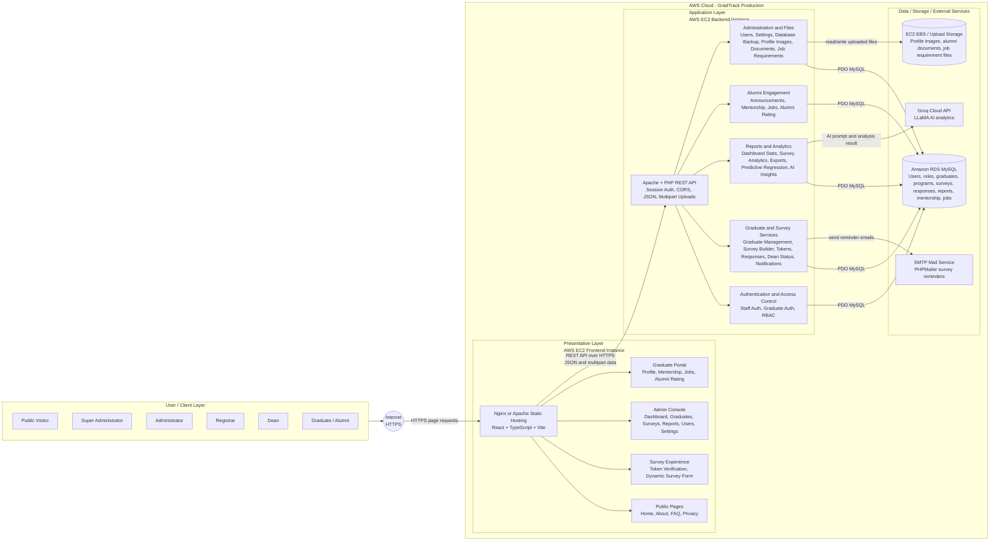

# GradTrack Layered Architecture - AWS EC2

This diagram updates the previous GradTrack layered architecture to reflect the current feature set and the target deployment where both the frontend and backend run on AWS EC2.

Generated diagram files:

- `documentation/layered-architecture-ec2.png`
- `documentation/layered-architecture-ec2.svg`
- `documentation/layered-architecture-ec2.mmd`

## Layer Notes

- User / Client Layer: public visitors, super administrator, administrator, registrar, dean, and graduate/alumni users access GradTrack through a browser.
- Presentation Layer: the React + TypeScript + Vite frontend is served from an AWS EC2 instance using Nginx or Apache.
- Application Layer: the PHP REST API runs on a separate AWS EC2 instance using Apache and handles authentication, graduate records, surveys, reports, alumni engagement, file uploads, and administrative actions.
- Data Layer: Amazon RDS MySQL stores the system data. Current uploaded files are stored under the backend `uploads` directory on EC2/EBS.
- External Services: PHPMailer sends survey reminder emails through an SMTP provider, and Groq's LLaMA model supports AI analytics.

If GradTrack later moves uploaded files to Amazon S3, replace the EC2 EBS / Upload Storage node with Amazon S3 Storage and route upload/download traffic from the backend API to S3.
